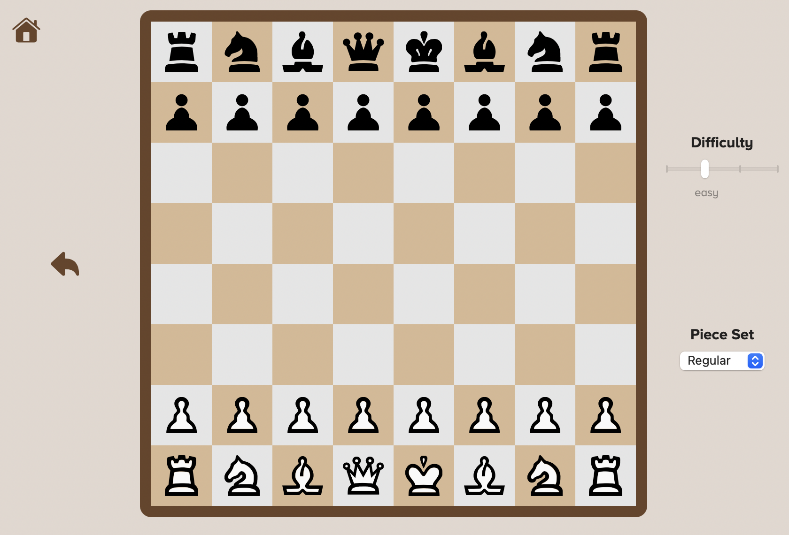

## Hummingbird

UCI-compatible chess engine with rating of ~1,900 Elo.

## Features

- Bitboards
- Iterative deepening
- Transposition table
- Simple position evaluation
- Basic move ordering
- Opening book
- Null-move pruning

## UI

UI is implemented in Swift (not included in this repository):

